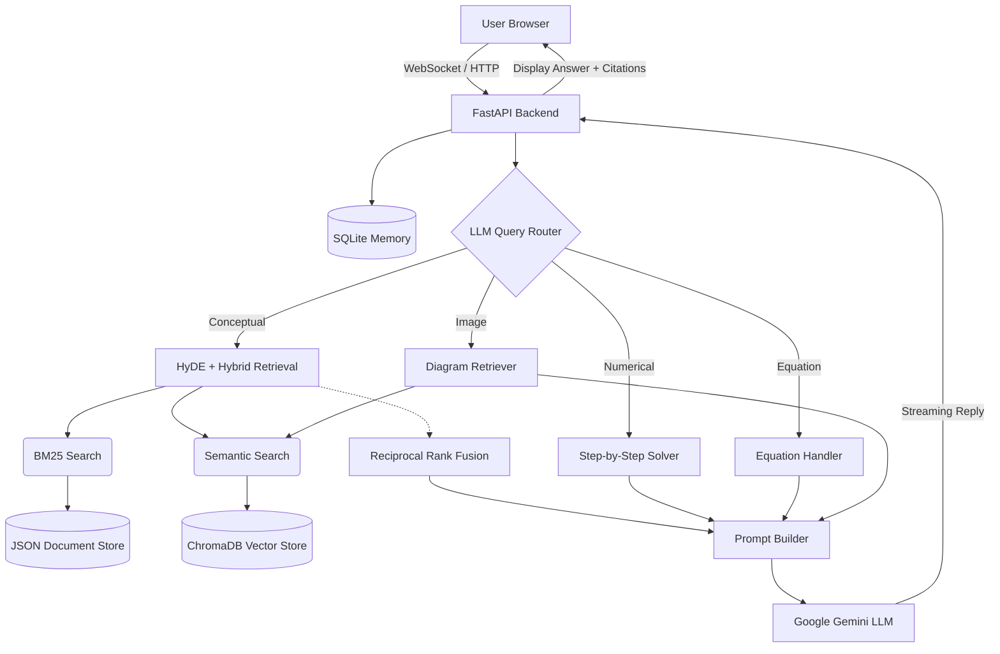

# Parishiksha — AI-Powered NCERT Learning Platform

    


**Parishiksha** is an advanced, multimodal Retrieval-Augmented Generation (RAG) system specifically designed for NCERT Class 9 Science. It serves as an intelligent AI tutor capable of understanding conceptual questions, solving numerical problems, explaining physics equations, and retrieving relevant textbook diagrams.

---

## 🚀 Key Features

* **Advanced Hybrid Retrieval Pipeline**: Combines BM25 (keyword search) and HuggingFace semantic embeddings using Reciprocal Rank Fusion (RRF) for high-precision context retrieval.
* **HyDE (Hypothetical Document Embeddings)**: Generates hypothetical textbook paragraphs on the fly to improve retrieval recall for complex, conceptual queries.
* **Multimodal Image Retrieval**: Extracts, OCRs, and semantically indexes diagrams from the NCERT PDFs. Automatically retrieves and displays relevant diagrams in the chat UI.
* **Intelligent Query Routing**: Uses an LLM-based query router to analyze intents (conceptual, numerical, equation, image) and route the query to the appropriate specialized pipeline.
* **Streaming Responses**: Real-time markdown streaming from Google Gemini, providing a fast, ChatGPT-like experience.
* **Persistent Conversational Memory**: SQLite-backed session storage allows the AI to remember the context of follow-up queries.
* **Premium User Interface**: A beautifully designed, dark-themed UI featuring suggestion chips, source citations, collapsible diagram cards, and LaTeX mathematical rendering.

---

## 🏗️ Architecture



*(For a deeper dive into the system architecture, please see [High Level Design (HLD)](docs/HLD.md) and [Low Level Design (LLD)](docs/LLD.md))*

---

## 🛠️ Prerequisites

Before you begin, ensure you have the following installed:

1. **Python 3.10+**
2. **Node.js (v18+) & npm**
3. **Google Gemini API Key** (You can obtain one from Google AI Studio)
4. (Optional) **Docker Desktop** if you prefer containerized deployment.

---

## 💻 Local Setup & Installation

### 1. Clone & Configure Environment

```bash
git clone https://github.com/yourusername/RAG_system_NCERT.git
cd RAG_system_NCERT

# Create a .env file in the root directory
echo "GEMINI_API_KEY=your_gemini_api_key_here" > .env
```

### 2. Backend Setup

```bash
# Create and activate a virtual environment
python -m venv venv
venv\Scripts\activate  # On Windows

# Install Python dependencies
pip install -r requirements.txt

# (First Time Only) Run Data Ingestion Pipeline to chunk PDFs and build ChromaDB
python src/ingestion/ingest_pipeline.py

# Start the FastAPI server
uvicorn backend.app:app --host 0.0.0.0 --port 8000 --reload
```
*The backend API will be available at `http://localhost:8000`*

### 3. Frontend Setup

Open a new terminal window:

```bash
cd frontend
npm install

# Start the React Vite development server
npm run dev
```
*The web application will be accessible at `http://localhost:5173`*

---

## 🐳 Docker Setup

For a streamlined, one-click deployment using Docker Compose:

```bash
# Ensure your .env file is present in the root directory
# Build and run the containers in detached mode
docker-compose up --build -d
```

* **Frontend**: `http://localhost:80`
* **Backend API**: `http://localhost:8000`

To view logs:
```bash
docker-compose logs -f
```
To stop the services:
```bash
docker-compose down
```

---

## 📂 Project Structure

```text
RAG_system_NCERT/
├── backend/                  # FastAPI Application Core
│   ├── api/                  # Route definitions (streaming, REST)
│   ├── database/             # SQLite conversational memory store
│   ├── handlers/             # Query processors (Equations, Images, Numerical)
│   ├── retrieval/            # BM25, Semantic, HyDE, RRF logic
│   └── vectorstore/          # ChromaDB Singleton clients
├── frontend/                 # React + Vite UI
│   ├── src/components/       # UI Components (Chat interface, Diagrams, Markdown)
│   └── src/App.jsx           # Main entry point & state management
├── src/                      # Data Pipeline
│   ├── chunking/             # Semantic & Parent-Child Splitters
│   └── ingestion/            # PDF extractors, PyMuPDF rendering
├── docs/                     # Architecture & API Specifications
├── data/                     # Raw PDFs and extracted images
├── chroma_db/                # Persistent Vector DB storage
└── docker-compose.yml        # Docker orchestration configuration
```

---

## 📚 Documentation Directory

For professional insights into how the system is engineered, please refer to the documents in the `docs/` folder:

* **[HLD.md](docs/HLD.md)** - High-Level Architecture, component interactions, and scalability.
* **[LLD.md](docs/LLD.md)** - Low-Level schema definitions, vector index structures, and API data flow.
* **[API_SPECIFICATION.md](docs/API_SPECIFICATION.md)** - Comprehensive endpoints documentation.

---

**Author**: Himkar Vashistha  
*BTech Data Science Engineering | PG in Agentic AI & AIML Engineering (IIT Gandhinagar)*
